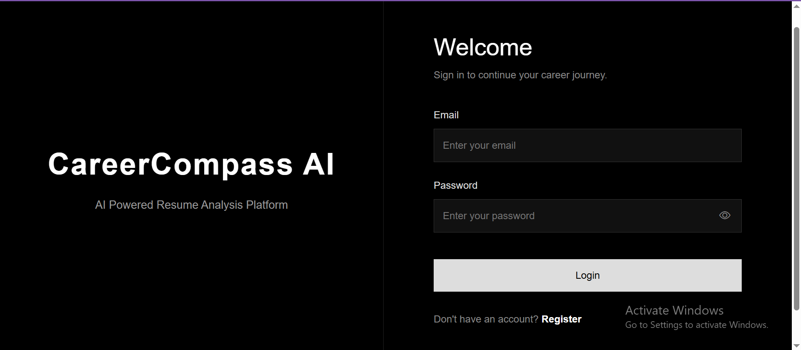
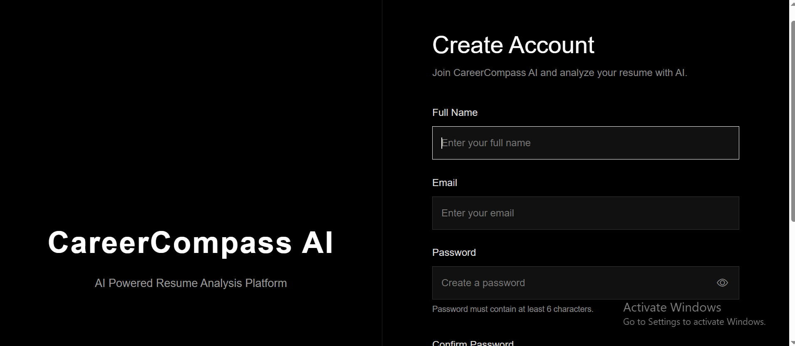
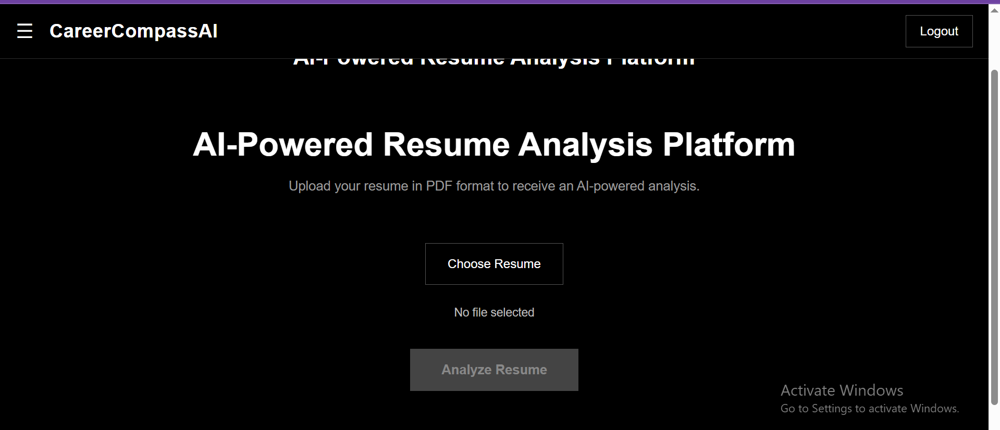
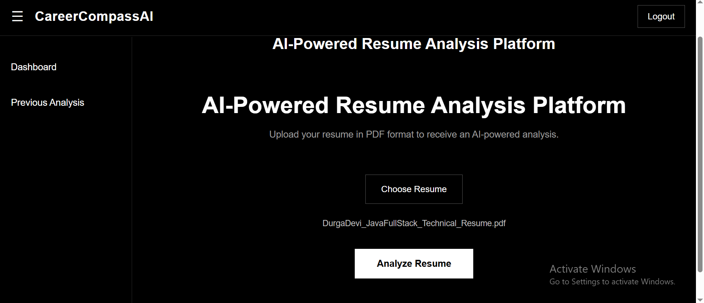
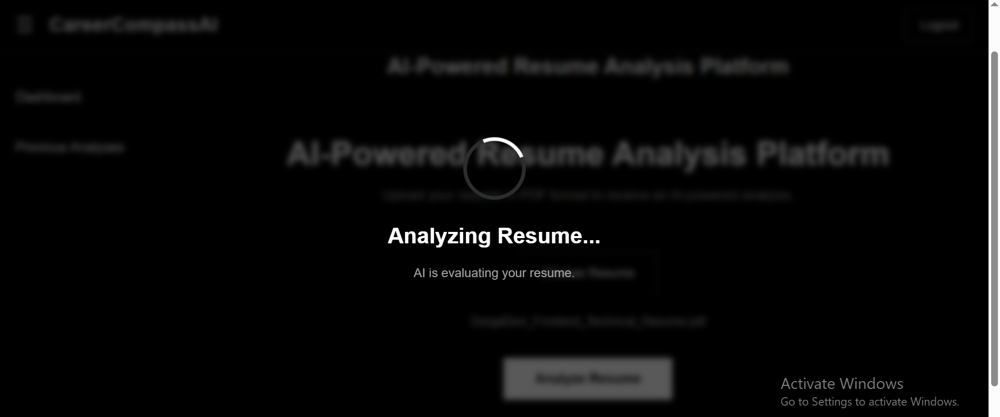
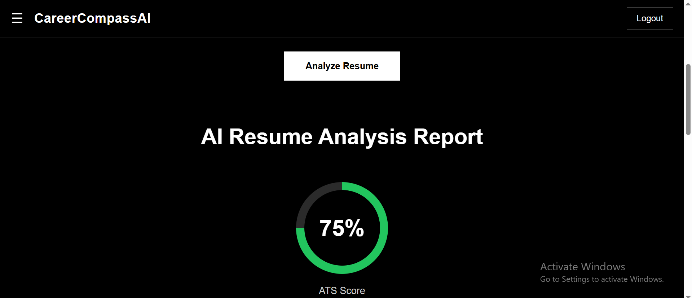
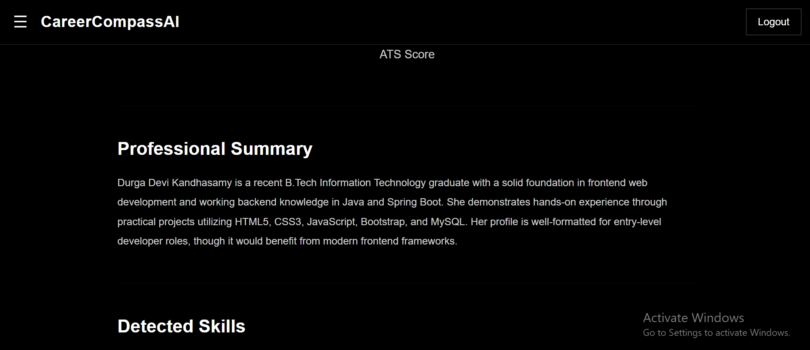
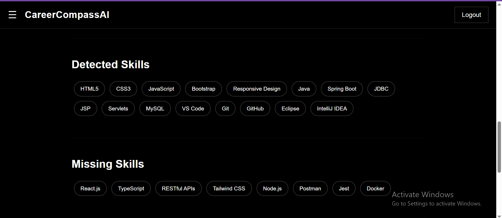
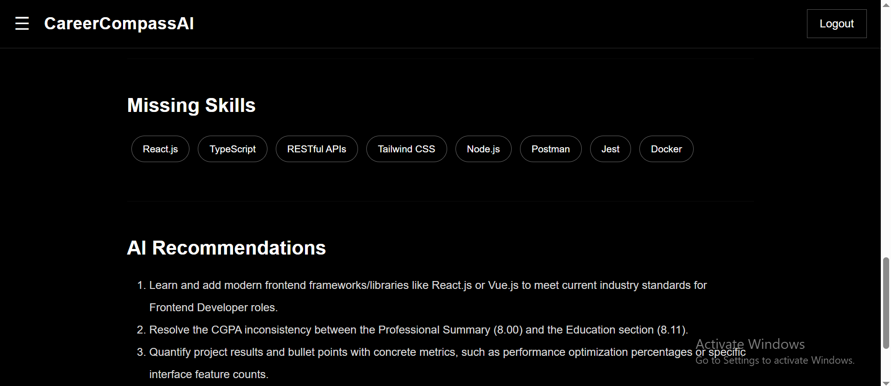
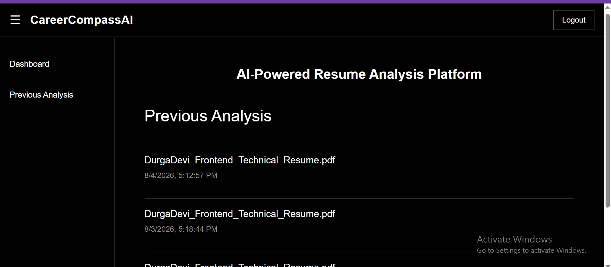

# 🚀 Career Compass AI

**Career Compass AI** is an AI-powered career guidance platform that helps users analyze their resumes, receive AI-generated feedback, and prepare for job opportunities.

It combines **React**, **Spring Boot**, **Spring Security (JWT)**, **TiDB Cloud**, and **Google Gemini AI** to provide a modern full-stack application for career development.

---

## 🌐 Live Demo

### Frontend
https://career-compass-frontend-tm16.onrender.com

### Backend API
https://career-compass-backend-fxzr.onrender.com

> **Note:** The backend is a REST API. Opening API endpoints directly in a browser may return `403` or `405` because they require HTTP requests (POST/GET) from the frontend or Postman.

---
## 📸 Screenshots

### Login Page



---

### Register Page



---

### Dashboard



---

---

### Upload



---

---

### Analyzing



---


### Resume Analysis





---

### Previous Analyses



---

# ✨ Features

- 👤 User Registration
- 🔐 JWT Authentication
- 🔒 Bcrypt Password Encryption
- 📄 Resume Upload
- 🤖 AI Resume Analysis using Gemini
- 💾 Cloud Database Storage
- 📊 Resume Analysis History
- 🌐 Responsive User Interface

---

# 🛠 Tech Stack

## Frontend

- React
- Vite
- Bootstrap
- Bootstrap Icons
- Axios
- React Router DOM

## Backend

- Java 17
- Spring Boot
- Spring Security
- JWT Authentication
- Spring Data JPA
- Hibernate

## Database

- TiDB Cloud (MySQL Compatible)

## AI

- Google Gemini API

## Deployment

- Render (Frontend)
- Render (Backend)
- GitHub

---

# 📂 Project Structure

```
CareerCompassAI
│
├── career-compass-frontend
│
└── career-compass-backend
```

---

# 🔐 Authentication

JWT Token-based authentication.

Public APIs

- POST /api/users/register
- POST /api/users/login

Protected APIs

- Resume Upload
- Resume Analysis
- User Dashboard

---

# ⚙️ Installation

## Clone Repository

```bash
git clone https://github.com/durga2523/career-compass-backend.git
```

or

```bash
git clone https://github.com/durga2523/career-compass-frontend.git
```

---

## Backend

```bash
cd career-compass-backend
```

Configure environment variables.

```properties
DB_URL=
DB_USERNAME=
DB_PASSWORD=
JWT_SECRET=
GEMINI_API_KEY=
```

Run

```bash
mvn spring-boot:run
```

---

## Frontend

```bash
cd career-compass-frontend
```

Install dependencies

```bash
npm install
```

Run

```bash
npm run dev
```

Build

```bash
npm run build
```

---

# 📡 API Endpoints

## User

| Method | Endpoint |
|----------|------------------------|
| POST | /api/users/register |
| POST | /api/users/login |

---

# 🔮 Future Enhancements

- Job Recommendation Engine
- ATS Resume Score
- Interview Preparation
- Cover Letter Generator
- Skill Gap Analysis
- Resume Templates
- Admin Dashboard

---

# 👩‍💻 Author

**Durga devi K**

GitHub

https://github.com/durga2523

LinkedIn

www.linkedin.com/in/durgadevi-kandhasamy

Email

<durgadevi96260@gmail.com>

---

# ⭐ If you like this project

Please consider giving it a ⭐ on GitHub.